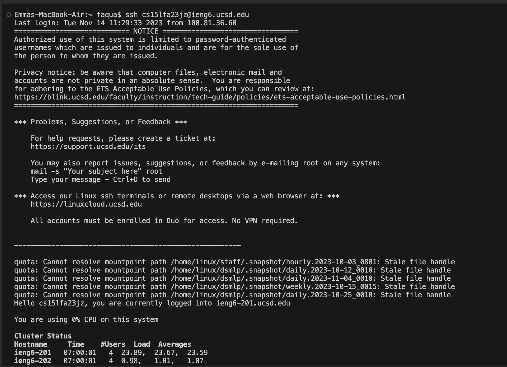
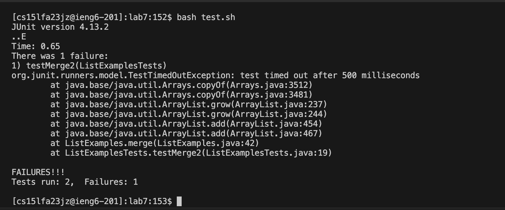
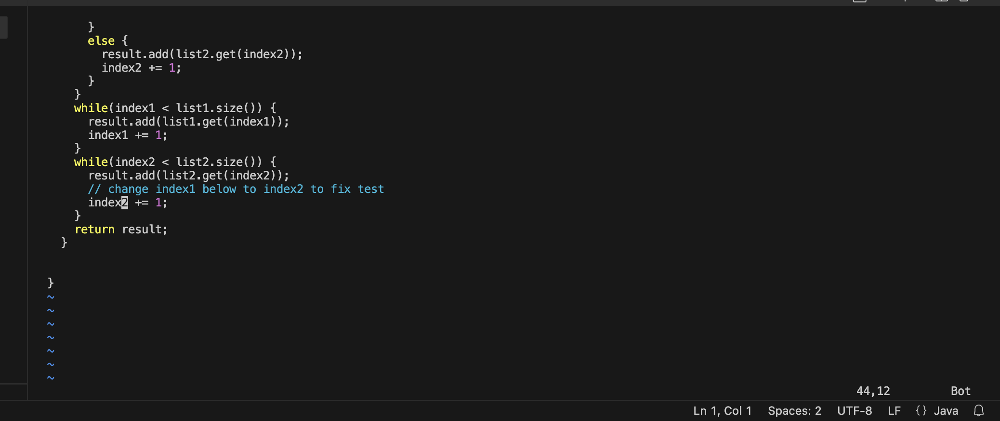
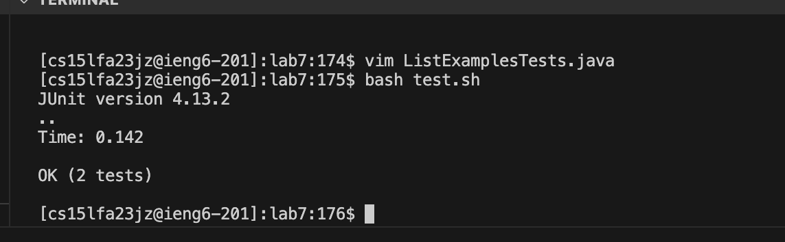
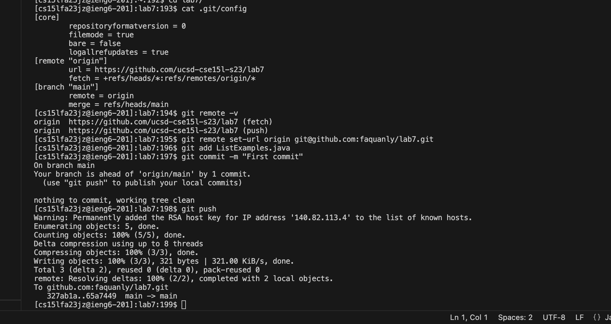
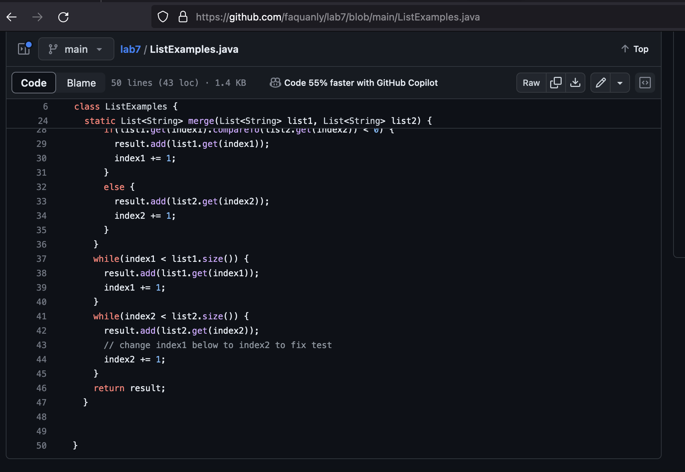

# Lab-Report-4-Vim
- Emma Nguyen - PID A18021060

1. **Step 4: Log into ieng6**
   
   - I used history command to display the previous commands which is include the `ssh cs15lfa23jz@ieng6.ucsd.edu` to log in to my ieng6 account. Then I navigated to that command and reused it.
   - Keys pressed: `<up><up><up>`, `<enter>`, the `ssh cs15lfa23jz@ieng6.ucsd.edu` command was 3 up in the search history, so I used up arrow to access it.
1. **Step 5: Clone your fork of the repository from your Github account (using the SSH URL)**
   
   - I used `<CTR-R>` to search the clone command history with `ssh` key word, it showed up the `ssh git@github.com:faquanly/lab7.git` and ready for me to use by press `<enter>`.
   - Keys pressed: `<CTR-R>`, `s`, `s`, `<enter>`, the `ssh git@github.com:faquanly/lab7.git`.
1. **Step 6: Run the tests, demonstrating that they fail**
   
   - Working directory: /home/linux/ieng6/cs15lfa23/cs15lfa23jz/lab7.
   - Using `bash test.sh` command to run the test. There is 1 failure when the test run.
   - Keys pressed: `<enter>` to run the `bash test.sh`.
1. **Step 7: Edit the code file to fix the failing test**
   
   - Working directory: /home/linux/ieng6/cs15lfa23/cs15lfa23jz/lab7.
   - Using vim editor to edit the code in ListExamples.java.
   - Keys pressed: `<shift g>`, `<up><up><up><up><up><up>``<right><right><right><right><right><right><right><right><right><right><right><right>`, `<i>`, `delete`, edit `<index 1>`, replace `1` by `2`, `<ESC>`, `<:wq>`, `<ENTER>`. Instead of using many down arrows, I used `shift g` to go to the end of file, then I go 6 ups to go to the line that I need to edit, then I used 12 right to navigated the cursor to the line `index1 += 1`, and edit `index1` become to `index2`. Then I escaped the insert mode, then save and quite the vim by pressing `<ESC>`, `<:wq>`, `<ENTER>`.
1. **Step 8: Run the tests, demonstrating that they now succeed**
   
   - Working directory: /home/linux/ieng6/cs15lfa23/cs15lfa23jz/lab7.
   - I use `bash test.sh` command to run the test again.
   - Keys pressed: `<ENTER>`. After type the `bash test.sh` command, I pressed `<ENTER>` to run `test.sh` file which already contained the command to compile and run the test.
1. **Step 9: Commit and push the resulting change to your Github account** (you can pick any commit message!)**
   
   - Here is my listExamples.java file after pushing the update one.
   
   - Keys pressed: `<CTR-R>`, `git add`, `<ENTER>`, `<CTR-R>`, `ssh -T`, `<ENTER>`, `<CTR-R>`, `git commit`, `<ENTER>`, `git push`, `<ENTER>`. I used Ctrl-R to search `git add` command and reused the `git add ListExamples.java`. Then I pressed `<CTR-R>` and `ssh - T` to find the `ssh -T git@github.com` and run it again to check my connection. Now, I can run `git commit` and `git push` to push my updated `ListExample.java` to my repository in gitHub. 

1. **Summarize the commands I used:**
   - Bash history: I use `history` command and up/down arrows to navigate to the `ssh cs15lfa23jz@ieng6.ucsd.edu` command when I wanted to log in my `ieng6` account. I also use `<Ctrl-R>` with `key word` to search and reuse the commands such as: `ssh -T git@github.com`, `git add ListExamples.java`.
   - Using `up arrow` and `<ENTER>`: I used them a lot to navigate to the previous commands and reused.
   - Keyboard shotcuts while editing commands: I used `<Ctrl-E>` to navigate the cursor to the end of the line, `<Ctrl-A>` to navigate the cursor to the beginning of the line, I used `<Ctrl-U>` to delete the line.
   - Using `<tab>`: I use `tab` everytime I want to do a command with a file or a directory, by typing a couple first letters and press `<tab>` to display the rest of the name. Using `<tab>` is very convenient and useful to save time and avoid typo.
   - Vim editor: I used `i` and `<ESC>` to switch betweed the insert mode and normal mode in vim editor. Beside using `up`, `down`, `left`, `right` arrow to move the cursor around, I can also use `h`, `j`, `k`, `l` to move the cursor around without lift up my hand. I also used `<shift g>` to go to the end of file, use `u` to undo the tasks. After editing the file, I use `:wq` in normal mode to save file and quit vim editor.

